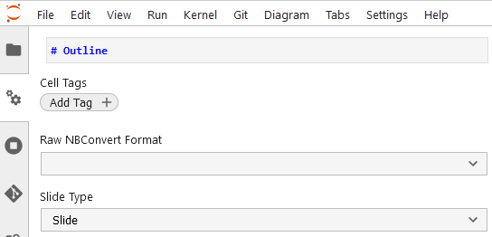
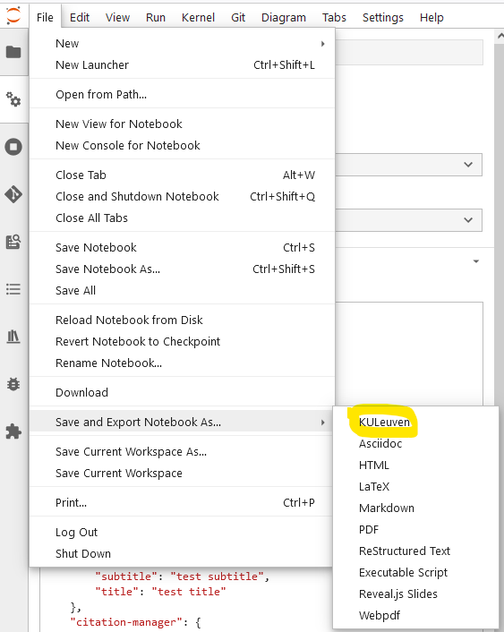
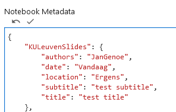
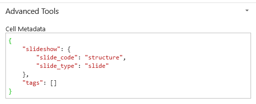

# Jupyter KUleuven slides Template

An example nbconvert template distributable through PyPi.

## Installation instructions
This nbconvert template can be installed with pip:
```
pip install jupyter-KULeuven-Slides
```
This will make the template "KULeuven" available in the python environment.


## Basic usage

First mark, using the tags menus, the start of each slide.



Using the jupyterlab menus: please select :"File -> Download as" -> "KULeuven"



Once installed, convert Jupyter notebooks into templated KULeuven slides by running:

```
jupyter nbconvert --to KULeuven Notebook.ipynb
```

Or if you want to add my preferred options:

```
jupyter nbconvert --to KULeuven --no-prompt --no-input --output-dir=_build/html/slides  Notebook.ipynb
```

It is good to add a title slide, by adding the notebook metadata:



Please do not forget to commit changes after adding metadata. (The small **v** on top of the box).

## Advanced usage



Please do not forget to commit changes after adding metadata. (The small **v** on top of the box).

## Develop notes

For building and developing this template, please [see here]( https://github.com/sheeshee/nbconvert-template-example/)

For the reveal.js template that is used as  a source, please [see here] (https://github.com/fmoralesc/reveal.js-kuleuven)

See [here](https://nbconvert.readthedocs.io/en/latest/customizing.html) for nbconvert's documentation on creating custom templates.