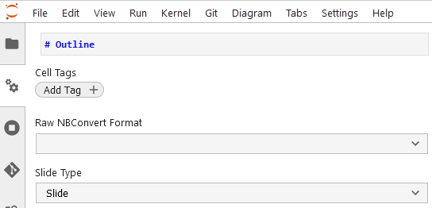
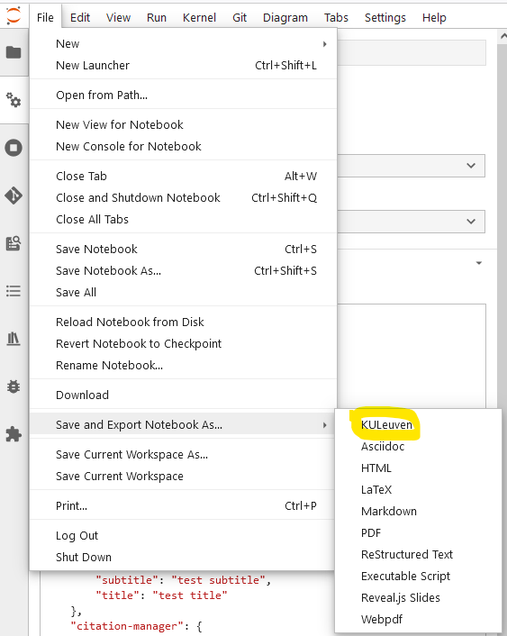
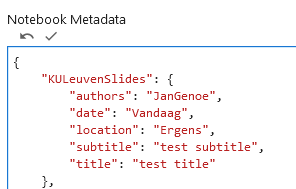
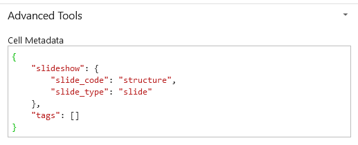

# Jupyter KULeuven slides Template

A nbconvert template to convert jupyterlab notebooks into reveal.js slides using the KULeuven presentation style.

# Installation instructions

This nbconvert template can be installed using pip:
```
pip install jupyter-KULeuven-Slides
```
This will make the reveal.js template "KULeuven" available in the python environment.


# Basic usage

First mark (using the ```property inspector``` menu at the left hand side) the start of each slide in any existing Jupyter notebook, by selecting ```slide```  under the topic ```Slide type```.



Subsequently, using the jupyterlab top-menu, please select :```File``` -> ```Save and Export Notebook as``` -> ```KULeuven```




# Command line

Converting Jupyter notebooks into templated KULeuven slides can also be done from the command line as follows:

```
jupyter nbconvert --to KULeuven Notebook.ipynb
```

or converting all notebooks in a folder:

```
jupyter nbconvert --to KULeuven *.ipynb
```

# Adding and modifying the title slide

You can add a title slide, by adding the **notebook metadata** a section labeled ```KULeuvenslides```. In this section the following tags can be optionally added:

```
"KULeuvenSlides": {
        "title": "test title",
        "subtitle": "test subtitle",
        "authors": "Jan Genoe",
        "location": "Ergens",
        "date": "Vandaag"
    },
```
 
 Please do not forget to commit these changes to the jupyter notebook changes after adding this metadata. (The small **v** on top of the box).
The screenshot below shows a possible implementation:



Please do not forget to commit changes after adding metadata. (The small **v** on top of the box).

## Selecting a global template


The following global templates are available:

* Sedes
* Normal 
* 1425  (The key referring to the foundation date of our university)

In this folder you can find 3 ```jupyter notebooks``` that are converted according to each of those 3 templates. 

The ```Normal``` template is added by adding to the **notebook metadata** 

```
"KULeuvenSlides": {
        "kuleuven_presentation_style": "Normal"
    },
```

Please do not forget to commit changes after adding metadata. (The small **v** on top of the box).

# Adding a structure slide in the presentation, using a different template

A structure slide, typically for the outline of the presentation, can be added at any point in the presentation by adding to the cell metadata under ```KULeuvenSlides```:
```
"KULeuvenSlides": {
        "slide_code": "structure"
    },
```
(typically there will be already the ```slide_type``` present in this section)


Please do not forget to commit changes after adding metadata. (The small **v** on top of the box).

# Develop notes

For building and developing this [template]( https://github.com/sheeshee/nbconvert-template-example/) has been used.

For the reveal.js template that is used as  a source, please [see here](https://github.com/fmoralesc/reveal.js-kuleuven)

See [here](https://nbconvert.readthedocs.io/en/latest/customizing.html) for nbconvert's documentation on creating custom templates.
